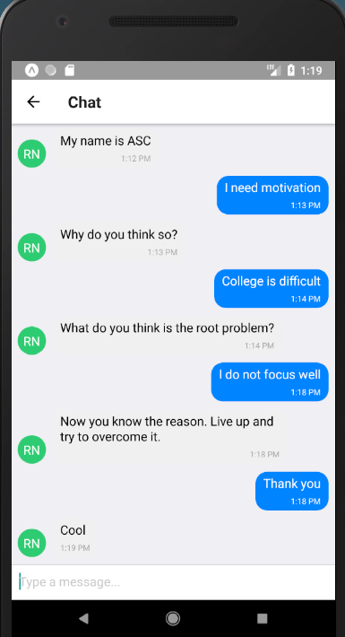

# Academics-Support-ChatBot
The ignorance of today's education system in giving personal care for a student is well accepted, as they are focused only in pushing more and more into the so called "rat-race".Providing individual care for students seems unpractical, if we solely depends on their trainers.Here as part of AngelHack Kochi 2018 Hackathon,a chatbot is presented to test the capability of technology in solving this issue.As chatbots and digital assistants are developing day by day,we see a bright future for this approach in solving these issues.
## Technology Stack
* React-Native
* Django
* Dialogflow
* Beautiful Soup

This repo contains the source code for the mobile app and the backend repo is available at : [https://github.com/jeswincyriac/AcademicsSupportBackend](https://github.com/jeswincyriac/AcademicsSupportBackend)

## Final Product

* Attendance, marks, other parameters could be tracked for analysing each student's performance.
* The bot can be made more productive by training on massive data. A sample output screenshot is given below 

   
## Acknowledgement
I use this space to mention the immense support by my AngelHack team members [Kuriakose](https://github.com/kryacose), [Farha](https://github.com/farhakareem) and [Joel](https://github.com/JohnoverBoard)
